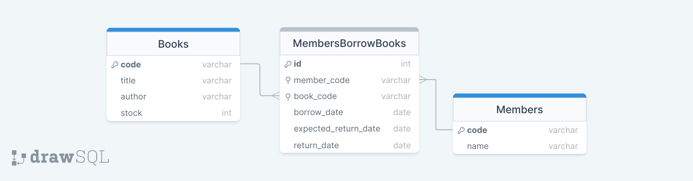

# book-lending-service
[](https://shields.io/) [](https://shields.io/)


RESTful API that lets members borrow and return books from a library, this app built with ExpressJS.

## Table of contents
* [General info](#general-info)
* [Technologies](#technologies)
* [RESTful API Endpoints](#restful-api-endpoints)
* [Setup](#setup)

## General info
The Book Lending Service is an API that lets members borrow and return books from a library. It provides endpoints to show book information, member information, and do borrowing-returning transactions. This app built with ExpressJS and Postgres.
### Entity Relationship Diagram


### Features
* Members can borrow books with conditions:
  - [x]  Members may not borrow more than 2 books
  - [x]  Members cannot borrow books that are unavailable
  - [x]  Borrowed books are not borrowed by other members
  - [x]  Member is currently not being penalized
  - [x]  Member with penalty cannot able to borrow the book for 3 days
 
* Member can returns the book with conditions:
  - [x]  The returned book is a book that the member has borrowed
  - [x]  If the book is returned after more than 7 days, the member will be subject to a penalty. 
  - [x]  Member is currently not being penalized

* Check the book:
  - [x]  Shows all existing books and quantities
  - [x]  Books that are being borrowed are not counted
  - [x]  Member is currently not being penalized
  
* Member check:
  - [x]  Shows all existing members
  - [x]  The number of books being borrowed by each member

* Member code generator:
  - [x]  The member code is auto generate when adding member with format (M001, M002, M003 ...)
  - [ ]  If the app restarted or crashed the counter will reset to zero
 

## Technologies
Project is created with:
* node : 14.16.1
* express : 4.18.2
* sequelize : 6.27.0
* pg : 8.8.0
* jest : 29.4.1

## RESTful API Endpoints
### API Endpoints
RESTful API Endpoints are shown in the table below:
| Method | Endpoint | Description |
| --- | --- | --- | 
| GET | `/api/members` | Get all members | 
| POST | `/api/members` | Add member |
| GET | `/api/books`| Get all books |
| POST | `/api/books` | Add book |
| POST | `/api/borrow` | Borrow a book |
| POST | `/api/return` | Return a book |

### Swagger 
Feel free to view REST API documentation with Swagger by entering this endpoint:
| Endpoint | Description |
| --- | --- | 
| `/api-docs` | View Documentation | 

## Setup
To run this project, install it locally using npm:
```
$ cd book-lending-app
$ npm install
```
please add .env before run the application, the suggested .env is bellow:
```
NODE_ENV = "development"
DB_USERNAME = "your_user_name"
DB_PASSWORD = "your_password"
DB_DBNAME = "your_db_name"
DB_HOST = 127.0.0.1
```
here is the code for the migration:
```
sequelize db:migrate
```
after that, you can use the app by:
```
$ npm start
```
